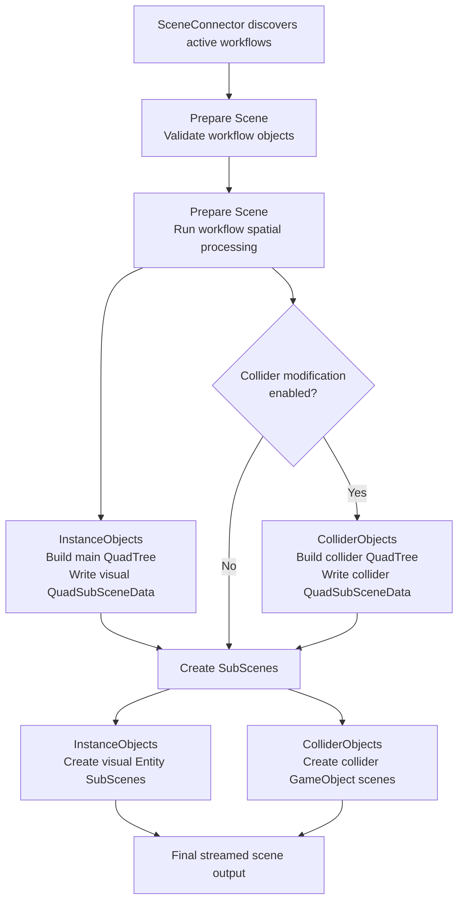

# Core Concepts: Workflows

In ProStream, **Workflows** are modular processing units that handle specialized object types, orchestrate data preparation, and generate spatial data structures. They form the backbone of the "Prepare Scene" and "Create SubScenes" processes.

## What is a Workflow?

Rather than hard-coding a single monolithic pipeline for scene processing, ProStream divides the work into distinct Workflows. A Workflow is responsible for:
1. Identifying a specific subset of objects in your scene (e.g., standard prefabs vs physics colliders).
2. Generating the appropriate spatial data (like a QuadTree grid).
3. Handling the creation and population of SubScenes for those specific objects.

## Key Workflow Components

Understanding workflows involves a few key types:

- **WorkflowAsset:** A <QuickInfo preset="terms.workflow-asset"><code>WorkflowAsset</code></QuickInfo>, implemented as a `ScriptableObject`, that defines the workflow's configuration (e.g., is it active, what are its grid settings).
- **WorkflowComponent:** A <QuickInfo preset="terms.workflow-component"><code>WorkflowComponent</code></QuickInfo>, implemented as a `MonoBehaviour` singleton in your scene, that executes the runtime logic for the workflow.
- **WorkflowContainer:** A <QuickInfo preset="terms.workflow-container"><code>WorkflowContainer</code></QuickInfo> that owns and manages all active <QuickInfo preset="terms.workflow-component"><code>WorkflowComponents</code></QuickInfo>.
- **WorkflowAssetContainer:** A <QuickInfo preset="terms.workflow-asset-container"><code>WorkflowAssetContainer</code></QuickInfo> that finds and tracks all active <QuickInfo preset="terms.workflow-asset"><code>WorkflowAssets</code></QuickInfo> in your project.

## Built-in Workflows

ProStream currently includes two primary workflows for scene generation:

### 1. InstanceObjectsWorkflow
This is the default, primary workflow for ProStream.
- It handles standard Unity Prefab instances.
- It is responsible for creating the main spatial **QuadTree**.
- It organizes visual geometry, props, and environment assets into streaming sections (Ground, LargeObjects, etc.).

See the [InstanceObjects Workflow guide](./workflow-guides/instanceobjects-workflow.md) for the full Prepare Scene and Create SubScenes flow.

### 2. ColliderObjectsWorkflow
The **ColliderObjectsWorkflow** creates separate collider-focused scene data for GameObject physics workflows.

**Key Technical Benefits:**
- **Separate physics scene data:** Lets you generate dedicated collider scenes alongside your visual Entity SubScenes.
- **Dynamic spatial organization:** Uses its own QuadTree data and can build grouped collider proxies for dense scenes.

::: info
Although ColliderObjects is documented alongside other workflows, the normal user-facing way to turn it on is through the Collider modification. The workflow settings still live in the Workflows system, but the extraction behavior is tied to that modification.
:::

See the [ColliderObjects Workflow guide](./workflow-guides/colliderobjects-workflow.md) for the full activation path and process breakdown.

<!-- Note: DataObjects Workflow and RemoteScenes Workflow are currently WIP and will be documented in a future release. -->

## Process Overview

The diagram below shows where the two current workflows share the same pipeline, where ColliderObjects branches through the collider modification path, and where both results contribute to the final streamed scene output.

:::details Process Flow Diagram

:::

## Workflow Lifecycle

Workflows follow a strict lifecycle integrated deeply into the <QuickInfo preset="terms.scene-connector"><code>SceneConnector</code></QuickInfo>.

1. **Discovery:** When the scene is loaded, the <QuickInfo preset="terms.scene-connector"><code>SceneConnector</code></QuickInfo> queries the <QuickInfo preset="terms.workflow-asset-container"><code>WorkflowAssetContainer</code></QuickInfo> to find all active and enabled <QuickInfo preset="terms.workflow-asset"><code>WorkflowAssets</code></QuickInfo> in the project.
2. **Activation:** The <QuickInfo preset="terms.scene-connector"><code>SceneConnector</code></QuickInfo> adds these assets to its internal list.
3. **Instantiation:** For every active workflow, the <QuickInfo preset="terms.workflow-container"><code>WorkflowContainer</code></QuickInfo> creates a child `GameObject` in the scene hierarchy and attaches the corresponding <QuickInfo preset="terms.workflow-component"><code>WorkflowComponent</code></QuickInfo>.
4. **Execution:** During the *Prepare Scene* and *Create SubScenes* operations, the <QuickInfo preset="terms.process-runner"><code>ProcessRunner</code></QuickInfo> iterates through all active <QuickInfo preset="terms.workflow-component"><code>WorkflowComponents</code></QuickInfo> and executes their respective stages (`Initialize`, `Execute`, `Cleanup`).

## How Workflows tie into the Main Processes

When you click **Prepare Scene** (Calculate Positions):
- **Phase 1:** Every active workflow is asked to validate its data (`CheckWorkflowObjects()`).
- **Phase 4:** Every active workflow executes its spatial calculations (e.g., generating the QuadTree grid and assigning objects to cells).

When you click **Create SubScenes**:
- The process loops through all active workflows, running them through an `Initialize` -> `Execute` -> `Cleanup` pipeline to physically generate the `.unity` scene files on disk and organize the objects within them.

## Detailed Guides

- [InstanceObjects Workflow](./workflow-guides/instanceobjects-workflow.md)
- [ColliderObjects Workflow](./workflow-guides/colliderobjects-workflow.md)
- [Workflows Configuration Guide](../editor-guide/engines/workflows-configuration.md)
